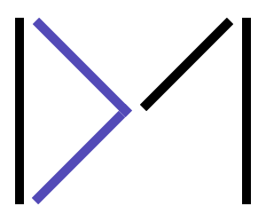

<p align="center">
  
</p>

<p align="center">
  
  
  
  
</p>

# 朱码（DrewMark）

受 [Markdown](https://daringfireball.net/projects/markdown/) 和 [Showdown](https://github.com/showdownjs/showdown) 启发的全功能型标记语言系统。朱码为纯文本内容制定了一系列规范化的语法规则，可轻松解析为标准的 HTML 代码。

---

## 为什么选择朱码？

Markdown 很棒，但也有局限。朱码从底层重新思考了标记语言的体验：

- **9 种文本修饰**，而非仅 2 种——粗体、斜体、下划线、删除线、高亮、上标、下标、小字体、注音
- **5 种有序列表**——阿拉伯数字、罗马数字（大/小写）、拉丁字母（大/小写），支持倒序
- **3 种无序列表**——实心圆、空心圆、方块，各有专属标记
- **内置表格支持**，含 `<thead>`、`<tbody>`、`<tfoot>`、跨列和跨行
- **原生多媒体嵌入**——音频和视频支持多编码格式、封面图、播放控制
- **引用出处**——行内引用和引用块均支持 `cite` 属性
- **全局属性系统**——可为任意元素添加 `id`、`class`、`style`、`lang`、`align`、`dir`、`title`、`data-*`
- **可折叠详情块**，支持多级嵌套
- **进度条**、**图片块**、**定义列表**、**样式块**等更多功能
- **无歧义语法**——花括号包裹 URL，每种修饰各有独立标记

---

## 快速示例

```drewmark
# 欢迎使用朱码

这是**粗体**，这是%%斜体%%，这是!!高亮!!。

## 任务列表
+*+ 实现解析器
-*- 撰写文档
+*+ 发布到 npm

## 表格
| 名称 | 版本  |
| ==== | ==== |
| 朱码 | v2.3 |
```

---

## 项目结构

本仓库仅包含**朱码语言规范**。各种功能仓库如下：

* [Javascript 解析器](../../../../drewneon/drewmark-js-parser)
* [Javascript 编辑器](../../../../drewneon/drewmark-js-editor)
* [Javascript 转换器](../../../../drewneon/drewmark-js-converter)

---

## 文档

完整语言规范：[docs/doc-cn.md](docs/doc-cn.md)

English docs: [docs/doc.md](docs/doc.md)

---

## 许可证

MIT
